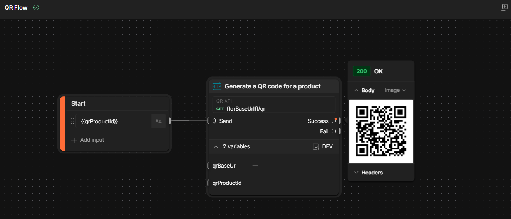

# Postman

Easily integrate with Postman using the provided swagger spec exposed in the [API](http://localhost:3000/api-docs).  Use the provided [endpoint](http://localhost:3000/swagger) to import the spec from the Postman UI.

You will also find, conveniently packaged for you in this directory, the [dev environment setup](./dev.postman_environment.json) for Postman calls to use when running this API.

See the example basic [Postman Flow Diagram](https://flow.pstmn.io/embed/qmEzSDamFcN4vt8eZnYqY/?theme=dark&frame=false)

Please see the [Project README](../README.md) for more details.